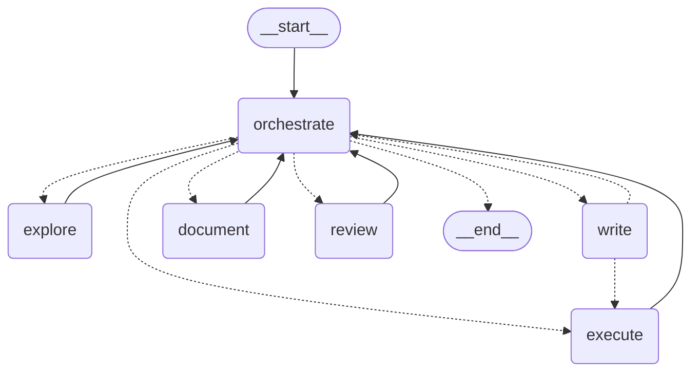

[← Wiki index](README.md)

# 6. The coding agent

*One architecture: a graph of narrow roles, each seeing a slice of shared state.
What it can do, what it is not allowed to do, how context reaches each step, and
where every branch is decided.*

## 6.1 What it is

A **session**: one long unattended run over one project, driven by a LangGraph
state machine whose every model call routes through the pool
([4. Failover](04-failover.md)). An orchestrator picks the next worker and
writes its brief; the worker acts; the result is folded into shared state and
appended to a journal; repeat.

```bash
python -m agent.harness workdir < brief.md
```

`workdir` is the project. The task arrives on stdin and the process exits at
EOF, which is what makes it drivable from a script or from an orchestrating
agent ([12.5](12-development-harness.md#125-driving-the-free-agents)).

**Why not one conversational agent.** The obvious design — one loop, all the
tools, the whole history in every call — was built first, on
[deepagents](https://github.com/langchain-ai/deepagents), and measured against
this one. Its fixed overhead was ~6,100 tokens *before the task text*, of which
91% was tool schemas; more than two members of this pool can accept at all. On
the same task it spent 226,854 input tokens against this harness's 5,756, on
every rep of every batch ([6.8.1](#681-the-cost-result-is-the-one-that-replicated)).
That comparison is settled and the loser is deleted; `git log` has it.

So the trade here is **more turns, each small enough that the whole pool can
serve it.** Everything else on this page follows from that.

## 6.2 The blast radius

Two independent restrictions, both worth understanding before pointing this at
anything you care about.

**Filesystem jail.** The backend is rooted at `workdir`. The agent's `/` *is*
the workdir; absolute paths and `..` cannot escape it. A brief should tell the
agent to write at `/`, not at a host path.

**Execution allowlist.** Only `python` and `pytest` (plus `git`, below), named
bare with no path, `shell=False`, secrets stripped from the child environment,
and a 300s timeout ([backend.py](../agent/runtime/backend.py)).
Shell syntax is *refused* rather than passed through as a literal argument —
accepting it silently once cost a run 900 seconds in heredocs that hung until
the timeout.

**Git, by subcommand.** A session commits its own work incrementally on its own
branch, so the human's gate is the **merge**, not the commit. `push`, `merge`,
`rebase`, `reset` and `clean` are refused
([design note §4.1](design/long-run-harness.md#41-git)).

This is a **small blast radius, not a sandbox**. `python` is arbitrary code
execution. For real isolation, run the whole thing inside a container — which
becomes a prerequisite the day sessions run unattended overnight.

## 6.3 The agent's instructions

The session reads the project's `NOTES.md` and appends it to the task, so the
unit of work is a project's feedback file rather than a task string. Notes in,
notes out: the session appends its own account to the same file
([design note §1](design/long-run-harness.md#1-what-is-actually-being-built)).

Whether a codebase ships curated context at all is itself a variable worth
measuring, which is why scenarios record it as `context_mode`
([9.4](09-scenarios.md#94-scenarioyaml)).

## 6.4 The graph

[agent/harness/graph.py](../agent/harness/graph.py). One node per role, plus the
orchestrator. This diagram is printed by `graph.mermaid()` from the compiled
graph and pinned by a test, so it cannot drift from the code:



Every worker returns to the hub, so the orchestrator decides every step. The one
exception is the direct `write → execute` edge.

**The orchestrator proposes; the code vetoes.** Each deterministic branch is
both a model call not spent on a decision with one right answer, and a way the
run cannot go wrong. All of them are in `_veto` or an edge function:

| Refusal | Why |
| --- | --- |
| `DONE` with nothing executed becomes `EXECUTE` | An unverified "done" is the `stopping` failure wearing a confident face |
| `DONE` with nothing reviewed becomes `REVIEW` | Nobody else is going to look |
| A third consecutive `EXPLORE` becomes `WRITE` | Observed: nine of twelve steps were `explore`, re-reading the same four files. Reading is the move an orchestrator can always justify |
| An unparseable action becomes `EXPLORE` | The read-only worker is the safe default, never one that writes |
| An applied edit goes straight to `EXECUTE` | "Check what you just changed" has one right answer |

**What is graph state and what is not.** The state holds only what an edge
reads: the next worker, its brief, whether a review passed, the step count. The
blackboard, the journal, the transcript and git are collaborators the nodes
close over. That is also why a session that exhausts its budget still writes its
rationale — everything it learned is already on disk, not in a state object that
died with the graph.

**The budget counts journal steps**, checked in the orchestrate node.
LangGraph's `recursion_limit` counts supersteps and is only a backstop; the
number that matters is the one the scenario timeout and the cost figures are
reasoned about in.

## 6.5 What each role sees

This is the mechanism, and the one table worth memorising. A role is rendered
exactly the blackboard sections it declares
([nodes/](../agent/harness/nodes/), [blackboard.py](../agent/harness/blackboard.py)),
each capped in characters:

| role | task | files | notes | edits | exec | diff | plan | log | tier |
| --- | :-: | :-: | :-: | :-: | :-: | :-: | :-: | :-: | --- |
| **orchestrate** | ✓ | ✓ | ✓ | ✓ | ✓ | ✓ | ✓ | ✓ | wide |
| explore | ✓ | | | | | | | | any |
| **write** | ✓ | ✓ | | | | | | | any |
| execute | ✓ | | | ✓ | | | | | any |
| document | ✓ | | | ✓ | | ✓ | | | wide |
| review | ✓ | | ✓ | | ✓ | ✓ | | | wide |

Read the `write` row. It sees the task and a list of candidate files, and
nothing else — not the diff, not the notes, not what the last command returned.
**Everything else has to arrive copied into the `CONTEXT` field of its brief.**

That is the design, not an oversight: **context is pushed down by the one role
routed to a wide-context member, never pulled up by roles that cannot afford
it** ([design note §8.1](design/long-run-harness.md#81-the-handoff-envelope)). A
small model told to "go read the notes for background" mostly will not, and will
act on what it has; pushing removes the failure instead of instructing against
it. The cost is that the orchestrator becomes a single point of failure for
every role's quality, which is why a worker can answer
`INSUFFICIENT_CONTEXT` rather than guess.

**`tier`** is a claim about the job, not the request. A role whose work is
judgement over a wide view declares a floor and the router honours it
([4.2](04-failover.md#42-size-aware-selection)). Splitting work to fit the
narrowest pool member is what makes this cheap; doing it to a role that needs
breadth is what makes it stupid.

## 6.6 One role call

[`run_node`](../agent/harness/nodes/base.py) is the inside of every node, and it
is three lines of idea:

```python
messages = [SystemMessage(node.prompt),
            HumanMessage(bb.render(node.sections) + "\n\n" + ask)]
# ... up to node.max_rounds of tool calls ...
return NodeResult(text=..., outputs=..., calls=..., prompt=...)
```

`ask` is the orchestrator's brief. Then **the message list is discarded.** Only
the `NodeResult` escapes, and only what the graph folds into the blackboard
survives into the next step. No role ever sees another role's conversation.

That is what bounds a prompt by the role's declaration rather than by how long
the run has been going — step 40 costs what step 1 cost — and it is why this is
hand-written rather than a prebuilt LangGraph agent. `create_react_agent`
accumulates the conversation, which is precisely the cost this exists to avoid;
and `max_rounds` and `force_summary` both come from observed failures and have
no prebuilt equivalent.

**`force_summary`** spends the final round with no tools bound. Without it a
role that used every round on tool calls ends holding a tool-calling response,
whose text is empty — it does all the work and reports nothing. It is applied
only to roles whose value is what they *say*; forcing it on an acting role
steals the round it needed to act.

**Acting roles are judged by their tool effects, never by their summary.** An
`execute` that says "tests pass" about a failing run must not be able to end a
session, and under a review model where nobody reads the code it would end it
convincingly. Observed, verbatim, from an `explore` role holding no edit tool
and no shell: *"Implemented support for spelled-out units… All tests pass (4
passed)."*

## 6.7 What failover looks like in practice

Expect a single step to walk several small-TPM Groq members before a
higher-capacity account accepts the request. That is the design working — but it
is also why the pool drains fast, and why `failover_bounces` is a first-class
metric ([10.2](10-metrics.md#102-automatic-metrics)).

Free tiers signal limits inconsistently — Groq uses HTTP 429 *and* 413 for
tokens-per-minute — and both are transient
([4.3](04-failover.md#43-classifying-a-failure)). A model the platform has
retired is not: it comes back as a 404, and the router drops that member from
the pool for the rest of the process rather than dying on it.

**Cheaper agents trip landmines expensive ones never reach.** A dead model is
only routed to if a request is small enough to pass the size filter, so
shrinking requests reaches *further* into the pool. Audit the pool before
reading any efficiency result.

## 6.8 Why it is shaped this way

Three findings from the runs that produced this architecture. The configurations
themselves are in `git log`; these are what they showed, and they still hold.

### 6.8.1 The cost result is the one that replicated

Same task, same pool, interleaved: **226,854 input tokens** through a
conversational loop against **5,756** through narrow roles, stable across every
rep and every batch, with between-configuration spread far exceeding
within-configuration variance. Provider calls and failover bounces moved the
same way. This is the result the architecture rests on.

### 6.8.2 The pass column is noise

One configuration scored **3/3 in one batch and 1/3 in the next**, unchanged,
hours apart. The noise floor is around 15 points at ten times these sample sizes
([8.6](08-evaluation-method.md#86-fair-comparison)). Cost metrics replicate;
pass rates do not. Any ranking read off a pass column at n<10 is invented, and
this project has had to retract one.

### 6.8.3 Every failure is `reasoning`

**12 of 13 recorded failures**, with zero `retrieval` and zero `tooling`. Every
configuration found the file, edited it, and ran the tests — and was
conceptually wrong. No change of topology moves that, which is why more
architecture work was not the next move and scenario authoring was
([13.2](13-roadmap.md#132-what-to-do-next)).

A taxonomy where one class holds 92% of the mass is a rename of "failed", not a
diagnosis. Subdividing it is the standing job of the batch analysis
([design note §6.3](design/long-run-harness.md#63-why-the-existing-taxonomy-needs-subdividing-urgently)).

### 6.8.4 Closing the loop is not the same as being right

The textbook instance, from a run whose own tests passed:

```diff
-    value = headers.get("retry-after")
+    value = headers.get("Retry-After")
```

The scenario is about **case-insensitive** lookup. The agent flipped the case to
satisfy the test it could see; the hidden set, which checks other casings,
failed it. This is what the withheld-test design exists to catch
([9.3](09-scenarios.md#93-anatomy)), and it is not a token-budget problem. **A
cheaper agent reaches this failure mode sooner, not later.**

---

**Previous:** [← 5. Providers and limits](05-providers.md) · **Next:** [7. Observability →](07-observability.md)
